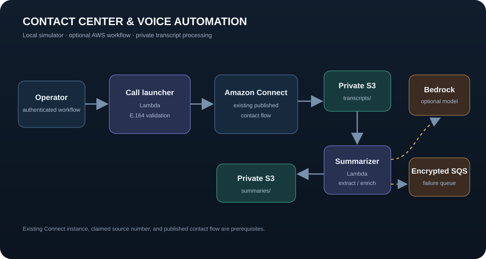

# Cloud Contact Center & Voice Automation

[](https://github.com/Samrith-026/contact-center-voice-automation/actions/workflows/ci.yml)

[Live portfolio](https://durgasamrithuppala.netlify.app/) · Built by [Durga Samrith Uppala](https://github.com/Samrith-026)

A local contact-center simulator and optional AWS workflow for outbound call routing and transcript summarization. The local path runs without cloud credentials. Terraform provisions Lambda integrations for an existing Amazon Connect instance, encrypted S3 transcript storage, optional Bedrock summarization, CloudWatch metrics, and a dead-letter queue for failed transcript processing.

## Architecture



Terraform supplies the launcher and summarizer functions. The Amazon Connect instance, claimed source phone number, and published contact flow are prerequisites that you provide. This repository does not configure a public call-launch API.

## Run the local demonstration

The local simulator requires Docker and does not place calls or send transcript data to AWS.

```bash
docker compose up --build --detach
python scripts/demo.py
docker compose down
```

Useful endpoints:

| Method | Endpoint | Purpose |
| --- | --- | --- |
| `GET` | `/health` | Container health |
| `POST` | `/calls` | Simulate E.164 outbound-call routing |
| `GET` | `/calls` | Recent simulated calls |
| `POST` | `/transcripts` | Extract a concise transcript summary |
| `GET` | `/summaries` | Recent local summaries |

All local state is in memory and is bounded by `HISTORY_LIMIT` (default `1000`). It clears when the container stops.

## Optional AWS deployment

This path can initiate real outbound calls and process customer transcripts. Use a development account and test destination numbers. Amazon Connect, Bedrock, S3, Lambda, and CloudWatch may incur charges; Bedrock model access may require separate enablement.

Set these values in a local `terraform/terraform.tfvars` file, which Git ignores:

```hcl
aws_region             = "us-east-1"
connect_instance_id    = "your-connect-instance-id"
contact_flow_id        = "your-published-contact-flow-id"
source_phone_number    = "+12145550123"
transcript_bucket_name = "your-globally-unique-bucket-name"
bedrock_model_id       = "" # empty uses extractive summarization
```

The source number must be claimed by that Connect instance. The contact flow must be published and configured to write transcript JSON objects under the bucket's `transcripts/` prefix. Keep Terraform state protected because it contains account-specific infrastructure values.

```bash
cd terraform
terraform init
terraform validate
terraform plan -out=tfplan
terraform apply tfplan
```

Invoke the launcher with an authenticated AWS principal:

```bash
aws lambda invoke \
  --function-name voice-poc-start-call \
  --cli-binary-format raw-in-base64-out \
  --payload '{"destination_phone_number":"+12145550100","attributes":{"customerId":"demo-42"}}' \
  response.json
```

Transcript objects written under `transcripts/` are summarized and stored under `summaries/` with a `.summary.json` suffix. When `bedrock_model_id` is empty, the summarizer uses a deterministic extractive fallback. Failed asynchronous invocations go to an encrypted SQS dead-letter queue.

## Run verification

```bash
python -m unittest discover -s tests -v
python -m compileall -q src
terraform -chdir=terraform init -backend=false
terraform -chdir=terraform validate
terraform fmt -check -recursive terraform
docker compose config --quiet
```

GitHub Actions runs the unit tests, initializes and validates Terraform, checks formatting, validates Compose, and builds the container image. Tests inject mock AWS clients and never call AWS.

## Security and privacy

- The call-launch Lambda has no public endpoint; invoke it through an authenticated AWS workflow.
- Transcript storage blocks public access, enables versioning, and encrypts objects at rest.
- IAM grants access only to the Connect instance and contact flow, transcript prefixes, summary prefix, metric namespace, optional Bedrock model, logs, and failure queue.
- Phone numbers and transcript bodies are not written to application logs.
- Use synthetic or approved test transcripts in demonstrations. Do not commit production transcripts or personal customer data.

See [RUNBOOK.md](./RUNBOOK.md) for triage and recovery.
